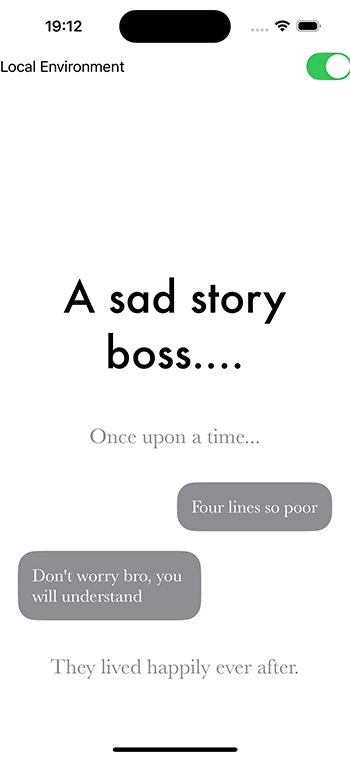

# Dialogue Structure

This section describes the structure and appearance of the Ink dialogue used in the project.

## Header Tag
The **Header tag** represents the main text in the dialogue. In the example provided, the header is:
`A sad story boss.... #Header`

## Character Tags
There are three types of **Character tags** used to represent different speakers or narrative elements:

1. **Author**: This tag is used for narrative text or commentary provided by the author.
   - Example: `Once upon a time... #Character: Author`
   
2. **Main Character**: This tag represents the dialogue of the main character.
   - Example: `Don't worry bro, you will understand #Character: Main`
   
3. **Other Character**: This tag is used for dialogue of any other characters involved in the scene.
   - Example: `Four lines, so poor #Character: Main`
  
4. **Inner monologue/Thoughts**: <i>...<\i> is used for thoughts of any characters involved in the scene.
   - Example: `<i>It'll be okay... It's just college! Lots of people go. And have roommates. And stuff.</i> #Character: Main`
   
## No Tag
No tag will be displayed as `#Character: Author`
   - Example: `They lived happily ever after.`

## Event Tag
Not used now:
> [!CAUTION] 
> There are seven positive events:
>   - Complimenting event: `#Event: Complimenting`
>   - Encouraging event: `#Event: Encouraging`
>   - Expressing-Gratitude event: `#Event: Expressing-Gratitude`
>   - Laughing-Smiling event: `#Event: Laughing-Smiling`
>   - Sharing-Ideas event: `#Event: Sharing-Ideas`
>   - Supporting-Offering-Help event: `#Event: Supporting-Offering-Help`
>   - Validating event: `#Event: Validating`
>
> And eight negative events:
>   - Blame-Accusation event: `#Event: Blame-Accusation`
>   - Criticism event: `#Event: Criticism`
>   - Dismissing event: `#Event: Dismissing`
>   - Gossiping event: `#Event: Gossiping`
>   - Ignoring-Avoidance event: `#Event: Ignoring-Avoidance`
>   - Interrupting event: `#Event: Interrupting`
>   - Sarcasm event: `#Event: Sarcasm`
>   - Worry-Hesitation event: `#Event: Worry-Hesitation`

There are events for each emotion:
   - Anger: `#Emotion Anger`
   - Disgust: `#Emotion Disgust`
   - Fear: `#Emotion Fear`
   - Enjoyment: `#Emotion Enjoyment`
   - Sadness: `#Emotion Sadness`

 for this events you need to aply `#Intensity: {number}` tag
   - Example: `They lived happily ever after. #Emotion: Enjoyment #Intensity: 5`

## Scene Tag
The indicator of scene will be marked as:  `#Scene: {Scene name}`
   - Example: `#Scene: Bardsall University, De Graff Towers, 4th Floor`

## Location Tag
The indicator for the location will be marked as:  `#Location: {Location name}`
   - Example: `#Location: dorm hallway, late afternoon or early evening`

## Cast Tag
The cast is marked with: `#Cast: {cast names}`.
   - Example: `#Cast: #Name: Alex #Name: Jayce #Name: Sidney`

## ContentWarnings
Content warnings is marked with: `#ContentWarning: {warning name}`.
   - Example: `#ContentWarning: Explicit`

## Image Tag
You can display an image in a story scene by implementing the **Image tag**.
   - Example: `#Image: university`

## Milestone Tag
The milestone message will be marked as `#Milestone: {number}` tag
 - Example: `#Milestone: 1`,  `#Milestone: 2`, `#Milestone: 3` etc.

## Example Layout
The example dialogue layout is visually presented in the attached image. The dialogue is structured with text bubbles representing the character's dialogue and narrative elements:

1. The main text is bold and centered at the top.
2. Character dialogues are presented in speech bubbles.
3. The narrative or commentary text is shown in a subtle, italicized style.

*Image for reference:*

